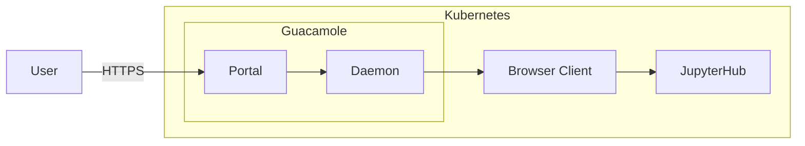
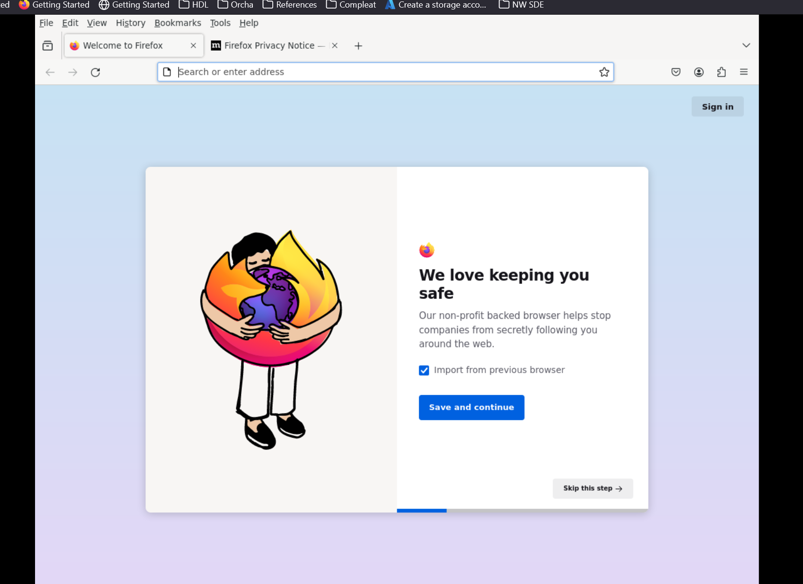

# iac-helm-guacamole
Helm Chart for guacamole


## Developer Guide
This helm release is still under development and has yet to be integrated into the wider chain of flux/helm configurations

### Proof of concept
This helm chart was created as part of a proof of concept for creating a container image that runs in a browser (firefox), the idea being that we have users connect to guacamole prior to connecting to jupyterhub to access other services.




#### Installing the POC
You'll need an instance of postgresql server, this will need to be accessible from the container:
* Create a new group called guacamole, the postgres user should be a member of this group
* Create a new user called guac@cluster.lsc-sde.local, this should be allowed to login and should be a member of the guacamole group, tha password to "guac"
* Create a new database, with the owner as the role guacamole
* login to the postgresql server as guac@cluster.lsc-sde.local
* execute the script in initdb.sql as that user
* Add cluster.lsc-sde.local to your /etc/hosts file with the IP address of your postgresql server
* deploy the helm chart

```bash
helm upgrade -i guacamole -n guacamole --create-namespace ./
```

* Add guacamole.lsc-sde.local to your /etc/hosts file pointing at the ingress ip address
* in your browser go to http://guacamole.lsc-sde.local
* login as *guacadmin* with the password *guacadmin*
* go to *settings* and *connections*
* add a new connection with the hostname **client**
* go back to the home screen and connect to the client, the password will be *1234*, this should load firefox inside of a VNC session



#### Notes
It does appear that this model could work, though a number of issues exist that would need to be solved in order to make this solution work:
1. Connections would need to be automatically configured in the guacamole database. An operator service could monitor the workspace bindings and configure the connections and memberships accordingly.
1. Guacamole would ideally need to be extended to call the Kubernetes API and request the pod when a session is requested 
1. JupyterHub authentication / Authorisation may be reconfigured to pass in a temporary token which would impersonate the user logged into the server
1. The container should shut down if the browser is closed in the VNC session
1. The container browser should be locked down so that it doesn't display the address bar
1. Network policies should be in place to allow traffic to jupyterhub/OHDSI only
1. Guacamole will need to be setup to handle proper auth
1. The apps will need to be thoroughly tested to ensure that they work with the browser as expected

#### Questions
* Will this effectively replace all current connections? (can we purpose build this as the only route into the system)